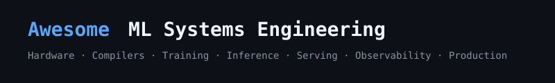

# Awesome ML Systems Engineering 

> A curated list of resources covering the full ML Systems Engineering stack: from hardware and compilers to distributed training, inference, and production operations.

ML Systems Engineering sits at the intersection of machine learning and systems software. This list is for practitioners who build, optimize, and operate ML systems at any scale. Only resources personally vetted and considered essential are included.

⭐ = must-read / essential resource &nbsp;&nbsp; 🎓 = academic paper or course &nbsp;&nbsp; 🛠️ = hands-on tool or framework

## Contents

- [Foundations](#foundations)
- [Books](#books)
- [Courses](#courses)
- [Hardware and Accelerators](#hardware-and-accelerators)
- [ML Frameworks](#ml-frameworks)
- [Neural Network Compilers](#neural-network-compilers)
- [Kernel Programming](#kernel-programming)
- [Distributed Training](#distributed-training)
- [Collective Communication](#collective-communication)
- [Memory-Efficient Training](#memory-efficient-training)
- [Inference and Serving](#inference-and-serving)
- [Quantization and Compression](#quantization-and-compression)
- [RLHF Infrastructure](#rlhf-infrastructure)
- [Vector Databases and Retrieval](#vector-databases-and-retrieval)
- [LLM Evaluation Frameworks](#llm-evaluation-frameworks)
- [LLM Observability and Tracing](#llm-observability-and-tracing)
- [Synthetic Data Generation](#synthetic-data-generation)
- [Multi-Modal Systems](#multi-modal-systems)
- [Benchmarking and Profiling](#benchmarking-and-profiling)
- [Data Engineering](#data-engineering)
- [MLOps and Production](#mlops-and-production)
- [LLMOps Platforms](#llmops-platforms)
- [Deployment Strategies](#deployment-strategies)
- [Fault Tolerance and Reliability](#fault-tolerance-and-reliability)
- [Security and Privacy](#security-and-privacy)
- [Sustainable AI](#sustainable-ai)
- [Networking and Interconnects](#networking-and-interconnects)
- [Storage Systems](#storage-systems)
- [Edge and Embedded ML](#edge-and-embedded-ml)
- [Landmark Papers](#landmark-papers)
- [Blogs and Newsletters](#blogs-and-newsletters)
- [Communities](#communities)
- [Conferences and Venues](#conferences-and-venues)
- [Cost Engineering](#cost-engineering)
- [Emerging Hardware](#emerging-hardware)
- [Model Governance and Compliance](#model-governance-and-compliance)
- [Agentic Systems Infrastructure](#agentic-systems-infrastructure)
- [PEFT and Model Merging](#peft-and-model-merging)
- [Cluster Management](#cluster-management)
- [Data Quality and Contracts](#data-quality-and-contracts)
- [Continuous Training and Retraining](#continuous-training-and-retraining)
- [Hyperparameter Optimization](#hyperparameter-optimization)
- [Experiment Management and Reproducibility](#experiment-management-and-reproducibility)
- [AutoML and Neural Architecture Search](#automl-and-neural-architecture-search)
- [CI/CD for ML](#cicd-for-ml)
- [Real-World Case Studies](#real-world-case-studies)

---

## Foundations

- [CS249r: Machine Learning Systems](https://mlsysbook.ai) - ⭐ Harvard's open textbook covering the full ML systems stack across two volumes: from neural computation to fleet-scale operations. The most comprehensive free reference in the field.
- [MLSys Conference Proceedings](https://mlsys.org) - The premier peer-reviewed venue for ML systems research. All proceedings are freely available.
- [The Deep Learning Compilation Survey](https://arxiv.org/abs/2002.08794) 🎓 - Comprehensive survey of deep learning compiler techniques; essential reading before diving into compiler backends.
- [Awesome ML Systems (GPU Mode)](https://github.com/gpu-mode/awesomeMLSys#readme) - GPU Mode community's onboarding reading list, strong on GPU kernel and attention mechanism resources.
- [awesome-seml](https://github.com/SE-ML/awesome-seml#readme) - Curated list on Software Engineering for ML, complementary to this list with a software process angle.
- [Awesome Production Machine Learning](https://github.com/EthicalML/awesome-production-machine-learning#readme) - Curated list of open-source libraries for deploying, monitoring, versioning, and securing ML models in production.

## Books

- [CS249r: Machine Learning Systems (GitHub)](https://github.com/harvard-edge/cs249r_book) - ⭐ Open-access two-volume textbook from Harvard covering ML workflows, hardware acceleration, distributed training, and responsible engineering. Source repo with exercises and labs.
- [Programming Massively Parallel Processors](https://www.elsevier.com/books/programming-massively-parallel-processors/kirk/978-0-323-91231-0) - Standard textbook for GPU programming with CUDA. Essential for anyone writing custom kernels.
- [Designing Data-Intensive Applications](https://dataintensive.net) - ⭐ Systems thinking for data pipelines, storage, and reliability. Directly applicable to ML data infrastructure.
- [Distributed Systems: Principles and Paradigms](https://www.distributed-systems.net/index.php/books/ds4/) - Foundational distributed systems theory that underpins distributed ML training. Available free online.
- [High Performance Python](https://www.oreilly.com/library/view/high-performance-python/9781492055013/) - Profiling and optimization techniques for Python-based ML workflows.
- [Designing Machine Learning Systems](https://www.oreilly.com/library/view/designing-machine-learning/9781098107956/) - ⭐ Chip Huyen's book on iterative processes for developing production ML systems, covering data, training, deployment, and monitoring.
- [Machine Learning Engineering](http://www.mlebook.com/wiki/doku.php) - Andriy Burkov's book on the engineering practices required to build and deploy production ML systems. Available pay-what-you-want.
- [RLHF Book](https://rlhfbook.com) - ⭐ Comprehensive free guide to the full RLHF pipeline from reward modeling to policy optimization.

## Courses

- [CS249r: TinyML and Efficient Deep Learning](https://efficientml.ai) 🎓 - MIT course on efficient ML covering quantization, pruning, and hardware-aware neural architecture design.
- [Full Stack Deep Learning](https://github.com/full-stack-deep-learning/fsdl-text-recognizer-2022-labs) - ⭐ End-to-end course on building and deploying ML-powered products; strong on MLOps, tooling, and production.
- [GPU Mode Lectures](https://github.com/gpu-mode/lectures) 🎓 - Community lecture series on GPU programming, CUDA, and Triton kernel development. Freely available on YouTube.
- [Stanford CS149: Parallel Computing](https://gfxcourses.stanford.edu/cs149/fall23) 🎓 - Foundational parallel computing course covering SIMD, multithreading, GPU architecture, and cache optimization.
- [CMU 15-418/618: Parallel Computer Architecture and Programming](https://www.cs.cmu.edu/~418/) 🎓 - Deep dive into parallel hardware and programming models from CMU. Slides and assignments publicly available.
- [Deep Learning Systems (dlsyscourse.org)](https://dlsyscourse.org) 🎓 ⭐ - Course on building ML frameworks from scratch; teaches autodiff internals, operator fusion, and hardware backends.
- [MIT 6.5940: TinyML and Efficient Deep Learning Computing](https://hanlab.mit.edu/courses/2023-fall-65940) 🎓 - MIT Han Lab's course on efficient neural networks, quantization, pruning, and hardware co-design.
- [MLOps Zoomcamp](https://datatalks.club/blog/mlops-zoomcamp.html) 🎓 - Free 3-month course covering Docker, MLflow, Mage, Prometheus, Evidently, and CI/CD for ML systems.
- [Made With ML](https://madewithml.com/courses/mlops) 🎓 - Comprehensive open curriculum for designing, developing, deploying, and iterating on production ML systems.
- [Machine Learning Engineering for Production (MLOps)](https://www.coursera.org/specializations/machine-learning-engineering-for-production-mlops) 🎓 - Google-authored Coursera specialization on production-grade ML systems and pipelines.

## Hardware and Accelerators

- [NVIDIA CUDA Programming Guide](https://docs.nvidia.com/cuda/cuda-c-programming-guide/) - ⭐ The authoritative reference for CUDA GPU programming. Covers memory hierarchy, thread model, and execution model in depth.
- [NVIDIA Hopper Architecture Whitepaper](https://resources.nvidia.com/en-us-tensor-core/gtc22-whitepaper-hopper) - Deep technical dive into H100 GPU architecture including Transformer Engine, NVLink 4.0, and HBM3.
- [Google TPU System Architecture](https://cloud.google.com/tpu/docs/system-architecture-tpu-vm) - Official documentation on TPU pod architecture, memory hierarchy, and high-speed interconnects.
- [AMD ROCm Documentation](https://github.com/ROCm/ROCm) - AMD's open GPU compute platform documentation. Increasingly relevant for large-scale training workloads.
- [Intel Gaudi Developer Documentation](https://github.com/HabanaAI/Model-References) - Intel's ML accelerator documentation, relevant for AWS DL1/DL2 instance workloads.
- [Hot Chips Symposium](https://www.hotchips.org/archives/) - Annual symposium proceedings covering cutting-edge processor, accelerator, and memory architecture from industry and academia.
- [AWS Trainium and Inferentia](https://aws.amazon.com/machine-learning/trainium/) - AWS purpose-built ML chips; Trainium for training and Inferentia for inference, with NeuronSDK compiler toolchain.
- [AMD CDNA3 Architecture](https://www.amd.com/en/products/accelerators/instinct/mi300.html) - AMD's MI300 series GPU architecture with unified CPU/GPU memory and HBM3 for large model training.
- [HBM (High Bandwidth Memory) Explained](https://arxiv.org/abs/2312.06585) 🎓 - Survey of HBM technology generations (HBM2e, HBM3, HBM3e) and their impact on ML accelerator memory bandwidth.
- [CXL (Compute Express Link)](https://www.computeexpresslink.org) - Open interconnect standard enabling memory expansion and pooling across CPUs and accelerators, relevant for large-model memory hierarchies.

## ML Frameworks

- [PyTorch](https://pytorch.org) ⭐ 🛠️ - The dominant research and production training framework. Deep documentation on autograd, TorchScript, and distributed training primitives.
- [JAX](https://github.com/google/jax) ⭐ 🛠️ - Google's composable function transformations (grad, jit, vmap, pmap) on top of XLA. Preferred for high-performance research code.
- [TensorFlow](https://www.tensorflow.org) 🛠️ - Google's production ML framework with strong TFX ecosystem for data pipelines, serving, and model management.
- [torch.compile (PyTorch 2.x)](https://pytorch.org/docs/stable/torch.compiler.html) - ⭐ Graph capture and compilation system bridging eager execution and compiler-level optimization in PyTorch 2.0+.
- [Flax](https://github.com/google/flax) 🛠️ - Neural network library built on JAX for flexible, high-performance model development. Used internally at Google DeepMind.
- [ONNX](https://onnx.ai) 🛠️ - Open standard for representing ML models enabling interoperability across frameworks and hardware targets.

## Neural Network Compilers

- [TVM (Apache)](https://tvm.apache.org) ⭐ 🛠️ - End-to-end deep learning compiler stack supporting CPUs, GPUs, and custom accelerators. Includes Ansor for learning-based auto-tuning.
- [MLIR](https://mlir.llvm.org) - ⭐ Multi-level intermediate representation framework from LLVM. The backbone of modern ML compiler infrastructure across XLA, IREE, and Torch-MLIR.
- [XLA](https://www.tensorflow.org/xla) - Accelerated Linear Algebra compiler used by JAX and TensorFlow. Generates highly optimized GPU/TPU kernels via operation fusion.
- [Triton](https://triton-lang.org) ⭐ 🛠️ - OpenAI's Python-based language and compiler for writing GPU kernels at high productivity. Used to implement FlashAttention and PagedAttention.
- [IREE](https://iree.dev) 🛠️ - Intermediate Representation Execution Environment; a compiler and runtime for running ML models on diverse hardware targets including mobile.
- [TensorRT](https://developer.nvidia.com/tensorrt) 🛠️ - NVIDIA's high-performance inference optimizer and runtime. Supports FP8, INT8, and sparsity for CUDA GPUs.
- [OpenXLA](https://openxla.org) - Community-governed XLA project targeting broad hardware portability beyond Google's internal stack.

## Kernel Programming

- [Triton Tutorials](https://triton-lang.org/main/getting-started/tutorials/index.html) - ⭐ Official step-by-step tutorials for writing GPU kernels in Triton, from vector addition to fused softmax to FlashAttention.
- [CUTLASS](https://github.com/NVIDIA/cutlass) 🛠️ - NVIDIA's CUDA Templates for Linear Algebra Subroutines. High-performance GEMM and convolution primitives used inside cuDNN and TensorRT.
- [FlashAttention](https://github.com/Dao-AILab/flash-attention) ⭐ 🛠️ - IO-aware attention implementation that tiles computation to minimize HBM reads/writes. Standard for efficient Transformer training and inference.
- [cuDNN Developer Guide](https://docs.nvidia.com/deeplearning/cudnn/developer-guide/index.html) - NVIDIA's deep learning primitives library documentation; covers convolution algorithms, tensor formats, and fused operations.
- [Leet GPU](https://leetgpu.com) 🛠️ - Practice platform for GPU kernel programming challenges in CUDA and Triton, analogous to LeetCode for kernel engineers.
- [GPU Mode Resource Stream](https://github.com/gpu-mode/resource-stream) - Curated stream of GPU kernel programming resources from the GPU Mode Discord community.

## Distributed Training

- [PyTorch Distributed Overview](https://pytorch.org/tutorials/beginner/dist_overview.html) - ⭐ Official overview of PyTorch distributed APIs: DDP, FSDP, and RPC. Best starting point before diving into framework internals.
- [Megatron-LM](https://github.com/NVIDIA/Megatron-LM) ⭐ 🛠️ - NVIDIA's framework for training large language models with tensor parallelism, pipeline parallelism, and data parallelism combined.
- [DeepSpeed](https://www.deepspeed.ai) 🛠️ - Microsoft's library for training massive models with ZeRO optimizer stages, pipeline parallelism, and CPU/NVMe offloading.
- [FSDP (Fully Sharded Data Parallel)](https://pytorch.org/docs/stable/fsdp.html) 🛠️ - PyTorch's native ZeRO-style model sharding. The standard approach for training large models within a single PyTorch job.
- [Alpa](https://github.com/alpa-projects/alpa) 🛠️ - System for automating parallelism strategy search across inter-op and intra-op partitioning dimensions.
- [Efficient Large-Scale LM Training on GPU Clusters](https://arxiv.org/abs/2104.04473) ⭐ 🎓 - Megatron-LM paper combining tensor, pipeline, and data parallelism. Essential reading for LLM training infrastructure.
- [GPipe](https://arxiv.org/abs/1811.06965) 🎓 - Google's pipeline parallelism paper introducing micro-batch gradient accumulation for memory-efficient model parallelism.
- [Switch Transformer](https://arxiv.org/abs/2101.03961) 🎓 - Google's paper on sparse Mixture-of-Experts training at scale with expert parallelism and load balancing.
- [DeepSpeed-Ulysses](https://arxiv.org/abs/2309.14600) 🎓 - Microsoft's sequence parallelism approach enabling training of extremely long-context models by partitioning sequence across devices.
- [Megatron-DeepSpeed](https://github.com/microsoft/Megatron-DeepSpeed) 🛠️ - Hybrid framework combining Megatron-LM's tensor/pipeline parallelism with DeepSpeed's ZeRO optimizer for billion-parameter training.
- [Tutel](https://github.com/microsoft/tutel) 🛠️ - Adaptive MoE implementation with dynamic top-k gating and expert load balancing for efficient sparse model training.
- [Pathways: Asynchronous Distributed Dataflow for ML](https://arxiv.org/abs/2203.12533) 🎓 - Google's system for training across heterogeneous accelerator islands with asynchronous data-parallel execution.

## Collective Communication

- [NCCL](https://developer.nvidia.com/nccl) ⭐ 🛠️ - NVIDIA's Collective Communications Library for multi-GPU and multi-node AllReduce, Broadcast, and Scatter operations. The backbone of most distributed training stacks.
- [Ring-AllReduce Explained](https://andrew.gibiansky.com/blog/machine-learning/baidu-allreduce/) - ⭐ Baidu's blog post explaining the ring-AllReduce algorithm that underpins bandwidth-optimal data parallel training.
- [Gloo](https://github.com/facebookincubator/gloo) 🛠️ - Facebook's collective communication library used as the CPU/Ethernet backend in PyTorch distributed.
- [MSCCL++](https://github.com/microsoft/mscclpp) 🛠️ - Microsoft's low-latency collective communication library with direct GPU kernel integration for fine-grained control.
- [MPI Standard](https://www.mpi-forum.org) - Message Passing Interface specification; the foundational collective communication model that NCCL and Gloo are built upon.

## Memory-Efficient Training

- [Gradient Checkpointing](https://github.com/cybertronai/gradient-checkpointing) ⭐ 🛠️ - Recompute activations during the backward pass rather than storing them, trading ~20% compute for ~80% memory reduction.
- [ZeRO: Memory Optimization Towards Training Trillion Parameter Models](https://arxiv.org/abs/1910.02054) ⭐ 🎓 - Microsoft DeepSpeed's optimizer that partitions optimizer state, gradients, and parameters across devices to enable trillion-parameter training.
- [Activation Checkpointing in PyTorch](https://pytorch.org/docs/stable/checkpoint.html) 🛠️ - PyTorch's built-in checkpoint utility for trading compute for memory in deep networks.
- [Mixed-Precision Training](https://arxiv.org/abs/1710.03740) 🎓 - NVIDIA's paper on training with FP16 and FP32 simultaneously using loss scaling, now standard practice for large model training.
- [bitsandbytes](https://github.com/bitsandbytes-foundation/bitsandbytes) 🛠️ - Library for 8-bit and 4-bit quantized optimizers and linear layers enabling QLoRA fine-tuning on consumer GPUs.
- [LoRA: Low-Rank Adaptation](https://arxiv.org/pdf/2106.09685) ⭐ 🎓 - Parameter-efficient fine-tuning by decomposing weight updates into low-rank matrices, reducing trainable parameters by orders of magnitude.

## Inference and Serving

- [vLLM](https://github.com/vllm-project/vllm) ⭐ 🛠️ - High-throughput LLM serving engine using PagedAttention for efficient KV cache management. Industry standard for production LLM serving.
- [TensorRT-LLM](https://github.com/NVIDIA/TensorRT-LLM) 🛠️ - NVIDIA's optimized LLM inference library with FP8 quantization, in-flight batching, and multi-GPU tensor parallelism support.
- [SGLang](https://github.com/sgl-project/sglang) 🛠️ - Structured generation language and runtime with RadixAttention for efficient KV cache reuse across requests.
- [llama.cpp](https://github.com/ggerganov/llama.cpp) 🛠️ - Pure C/C++ LLM inference with quantization support. Runs on CPUs and Apple Silicon without framework dependencies.
- [Triton Inference Server](https://github.com/triton-inference-server/server) 🛠️ - NVIDIA's production-grade model serving platform with dynamic batching, model ensembles, and multi-framework support.
- [ONNX Runtime](https://onnxruntime.ai) 🛠️ - Cross-platform, high-performance inference engine for ONNX models across CPU, GPU, and edge targets.
- [PagedAttention paper](https://arxiv.org/pdf/2309.06180) - ⭐ vLLM's key paper on virtual memory-inspired KV cache management enabling high-throughput LLM serving without memory waste.
- [Speculative Decoding](https://arxiv.org/abs/2211.17192) 🎓 - Technique for accelerating autoregressive generation using a small draft model to propose tokens verified by the full model.
- [Continuous Batching for LLM Inference](https://www.anyscale.com/blog/continuous-batching-llm-inference) - ⭐ Anyscale's explanation of iteration-level batching, the key scheduling innovation behind modern high-throughput LLM serving.
- [Ollama](https://github.com/ollama/ollama) 🛠️ - Simple local LLM serving with automatic quantization and hardware detection, ideal for development and edge deployment.
- [Text Generation Inference (TGI)](https://github.com/huggingface/text-generation-inference) 🛠️ - Hugging Face's production LLM serving toolkit with tensor parallelism, continuous batching, and flash attention support.
- [Outlines](https://github.com/dottxt-ai/outlines) 🛠️ - Structured text generation library enforcing JSON schema, regex, and grammar constraints on LLM outputs at the token level.
- [Medusa](https://github.com/FasterDecoding/Medusa) 🛠️ - Speculative decoding framework adding multiple decoding heads to predict several future tokens simultaneously, improving throughput without quality loss.
- [Disaggregated Prefill for LLM Serving](https://arxiv.org/abs/2401.09670) 🎓 - Paper on separating prefill (prompt processing) and decode phases across different hardware to optimize GPU utilization and latency.
- [Prefix Caching in vLLM](https://docs.vllm.ai/en/latest/features/automatic_prefix_caching.html) 🛠️ - Automatic prefix caching enabling reuse of KV cache across requests with shared prompt prefixes, reducing redundant computation.

## Quantization and Compression

- [GPTQ](https://arxiv.org/abs/2210.17323) ⭐ 🎓 - Post-training quantization for generative models enabling 4-bit inference of large language models with minimal accuracy loss.
- [AWQ (Activation-aware Weight Quantization)](https://arxiv.org/abs/2306.00978) 🎓 - Hardware-efficient 4-bit quantization that preserves salient weights identified by activation magnitude analysis.
- [SparseGPT](https://arxiv.org/abs/2301.00774) 🎓 - One-shot unstructured pruning for large language models achieving 50% sparsity without retraining.
- [Knowledge Distillation Survey](https://arxiv.org/abs/2006.05525) 🎓 - Comprehensive survey of knowledge distillation techniques for model compression across architectures and tasks.
- [GGUF Format](https://github.com/ggerganov/ggml/blob/master/docs/gguf.md) - File format used by llama.cpp for quantized model storage and memory-mapped loading on CPU and GPU.

## RLHF Infrastructure

- [OpenRLHF](https://github.com/OpenRLHF/OpenRLHF) ⭐ 🛠️ - Production-ready end-to-end RLHF framework combining Ray, DeepSpeed ZeRO-3, and vLLM for scalable policy optimization.
- [TRL (Transformer Reinforcement Learning)](https://huggingface.co/docs/trl) ⭐ 🛠️ - Hugging Face library for RLHF, GRPO, DPO, and PPO fine-tuning of language models with a clean trainer API.
- [veRL](https://github.com/volcengine/verl) 🛠️ - ByteDance's RLHF training framework with fine-grained parallelism and efficient GPU utilization for large-scale policy training.
- [RLHF: Reinforcement Learning from Human Feedback Survey](https://arxiv.org/abs/2504.12501) 🎓 - Up-to-date survey of RLHF methods, reward modeling, and alignment infrastructure.
- [RLHF Reward Modeling Recipes](https://github.com/RLHFlow/RLHF-Reward-Modeling) 🛠️ - Practical recipes and code for training state-of-the-art reward models for RLHF pipelines.

## Vector Databases and Retrieval

- [Milvus](https://github.com/milvus-io/milvus) ⭐ 🛠️ - Open-source distributed vector database optimized for billion-scale similarity search with GPU acceleration.
- [Qdrant](https://qdrant.tech) 🛠️ - High-performance open-source vector database written in Rust with filtering, payload indexing, and on-disk storage.
- [Weaviate](https://weaviate.io) 🛠️ - Open-source vector database with built-in hybrid search combining vector similarity with BM25 keyword search.
- [pgvector](https://github.com/pgvector/pgvector) 🛠️ - Vector similarity search extension for PostgreSQL. Simplest path to production vector search for teams already on Postgres.
- [Chroma](https://www.trychroma.com) 🛠️ - Lightweight embeddable vector database designed for LLM application development. Easy to run locally.
- [FAISS](https://github.com/facebookresearch/faiss) ⭐ 🛠️ - Facebook AI's library for efficient similarity search and clustering of dense vectors. The foundational building block for most vector databases.
- [Pinecone](https://www.pinecone.io) 🛠️ - Fully managed serverless vector database with automatic scaling and low-latency retrieval for production RAG systems.

## LLM Evaluation Frameworks

- [DeepEval](https://deepeval.com) ⭐ 🛠️ - Python LLM evaluation framework with 50+ metrics including G-Eval, hallucination detection, and RAG-specific evaluators using LLM-as-a-judge.
- [RAGAS](https://docs.ragas.io) 🛠️ - Evaluation framework specifically designed for retrieval-augmented generation systems, measuring faithfulness, relevancy, and context precision.
- [TruLens](https://www.trulens.org) 🛠️ - LLM feedback and observability framework for iterative evaluation with human and automated feedback integration.
- [LM Evaluation Harness](https://github.com/EleutherAI/lm-evaluation-harness) ⭐ 🛠️ - EleutherAI's unified framework for evaluating language models across hundreds of benchmarks. Used by the Open LLM Leaderboard.
- [BERTScore](https://github.com/Tiiiger/bert_score) 🛠️ - Neural text evaluation metric using contextual embeddings for semantic similarity scoring of generated outputs.
- [MT-Bench](https://arxiv.org/abs/2306.05685) 🎓 - Multi-turn benchmark using GPT-4 as judge to evaluate instruction-following and reasoning ability of chat models.

## LLM Observability and Tracing

- [Langfuse](https://langfuse.com) ⭐ 🛠️ - Open-source LLM observability platform with full request tracing, evaluation, and prompt management via OpenTelemetry.
- [Phoenix (Arize)](https://phoenix.arize.com) 🛠️ - Open-source ML observability tool for tracing LLM applications, evaluating outputs, and detecting drift in CV and tabular models.
- [OpenLLMetry](https://www.traceloop.com) 🛠️ - Non-intrusive OpenTelemetry-based instrumentation for LLM applications. Supports OpenAI SDK, LangChain, and most major frameworks.
- [LangSmith](https://smith.langchain.com) 🛠️ - LangChain's platform for tracing, evaluating, and deploying LLM applications with debugging tools for chain and agent runs.
- [Helicone](https://www.helicone.ai) 🛠️ - LLM observability proxy for logging, caching, rate limiting, and optimizing LLM API calls across providers.
- [Evidently AI](https://www.evidentlyai.com/blog) 🛠️ - Open-source ML monitoring library for detecting data drift, concept drift, and model performance degradation in production.

## Synthetic Data Generation

- [NeMo Curator](https://github.com/NVIDIA/NeMo-Curator) ⭐ 🛠️ - NVIDIA's scalable data curation library with pre-built pipelines for synthetic data generation used in training Nemotron-4 340B.
- [Distilabel](https://github.com/argilla-io/distilabel) 🛠️ - Framework for generating synthetic datasets and AI feedback using LLM pipelines, built on top of the Argilla ecosystem.
- [DataDreamer](https://github.com/datadreamer-dev/DataDreamer) 🛠️ - Library for synthetic data generation, prompt-based data augmentation, and dataset creation from existing models.
- [The Data-Centric AI Resource Hub](https://datacentricai.org) - Andrew Ng's initiative on systematic data engineering for ML with tools and benchmarks for data quality improvement.

## Multi-Modal Systems

- [CLIP](https://github.com/openai/CLIP) ⭐ 🛠️ - OpenAI's contrastive image-language pretraining model. Foundational architecture for multimodal retrieval and zero-shot classification.
- [LLaVA](https://llava-vl.github.io) 🛠️ - Large Language and Vision Assistant; instruction-tuned multimodal model for visual question answering built on LLaMA.
- [BLIP-2](https://arxiv.org/abs/2301.12597) 🎓 - Salesforce's bootstrapped vision-language pretraining framework using a lightweight Querying Transformer to bridge image and text encoders.
- [ImageBind](https://github.com/facebookresearch/ImageBind) 🛠️ - Meta's model binding six modalities (image, text, audio, depth, thermal, IMU) into a single embedding space.
- [Open Flamingo](https://github.com/mlfoundations/open_flamingo) 🛠️ - Open-source reproduction of DeepMind's Flamingo multimodal LLM supporting in-context learning with interleaved images and text.

## Benchmarking and Profiling

- [MLPerf](https://mlcommons.org/benchmarks/) - ⭐ Industry-standard ML benchmark suite covering training and inference across diverse hardware platforms. The definitive measure of ML system performance.
- [Roofline Model](https://people.eecs.berkeley.edu/~kubitron/cs252/handouts/papers/RooflineVyNoYellow.pdf) ⭐ 🎓 - Performance model for identifying compute vs. memory bottleneck in GPU kernels. Essential mental model for any ML systems engineer.
- [NVIDIA Nsight Systems](https://developer.nvidia.com/nsight-systems) 🛠️ - System-wide performance analysis tool for GPU workloads, essential for identifying CPU-GPU synchronization and pipeline bottlenecks.
- [NVIDIA Nsight Compute](https://developer.nvidia.com/nsight-compute) 🛠️ - Kernel-level profiler for CUDA applications with roofline analysis and memory throughput breakdown.
- [PyTorch Profiler](https://pytorch.org/tutorials/recipes/recipes/profiler_recipe.html) 🛠️ - Built-in PyTorch profiler with TensorBoard integration for operator-level CPU and GPU timing.
- [AI and Memory Wall](https://arxiv.org/abs/2403.14123) 🎓 - Analysis of how memory bandwidth limits LLM inference throughput across current and future hardware.
- [LLM-Perf Leaderboard](https://huggingface.co/spaces/optimum/llm-perf-leaderboard) - Hugging Face benchmark comparing LLM inference throughput and latency across hardware configurations.

## Data Engineering

- [Apache Arrow](https://arrow.apache.org) ⭐ 🛠️ - Columnar in-memory data format enabling zero-copy data sharing between ML frameworks and data systems.
- [WebDataset](https://github.com/webdataset/webdataset) 🛠️ - Streaming dataset format for large-scale training from object storage, fully compatible with PyTorch DataLoader.
- [FFCV](https://ffcv.io) 🛠️ - Fast data loading library that reduces training data pipeline bottlenecks via a binary beton format with asynchronous loading.
- [Petastorm](https://github.com/uber/petastorm) 🛠️ - Uber's library for training deep learning models directly from Parquet datasets in HDFS or S3.
- [DVC (Data Version Control)](https://dvc.org) 🛠️ - Git-integrated versioning for datasets and models with clean separation of data, training, and deployment lineage.
- [Delta Lake](https://delta.io) 🛠️ - ACID transactions and versioning for data lakes, enabling reliable ML feature pipelines and reproducible dataset snapshots.
- [Feature Store Comparison](https://www.featurestore.org) - Community resource comparing feature store architectures including Feast, Hopsworks, and Tecton.

## MLOps and Production

- [Kubeflow](https://www.kubeflow.org) 🛠️ - Kubernetes-native ML platform for orchestrating training pipelines, hyperparameter tuning, and serving at scale.
- [MLflow](https://mlflow.org) 🛠️ - Open-source platform for experiment tracking, model registry, and multi-framework deployment. MLflow 3.0 adds GenAI lineage tracking.
- [Ray](https://www.ray.io) ⭐ 🛠️ - Distributed computing framework for scaling ML workloads with Ray Tune, Ray Train, and Ray Serve as first-class components.
- [Weights & Biases](https://wandb.ai) 🛠️ - Experiment tracking, artifact versioning, and collaborative ML development platform. Widely adopted in both research and production.
- [ZenML](https://www.zenml.io) 🛠️ - MLOps framework for building portable, reproducible ML pipelines with integrations for RAG, fine-tuning, and evaluation.
- [Seldon Core](https://github.com/SeldonIO/seldon-core) 🛠️ - Kubernetes-native model serving with canary deployments, A/B testing, and explainability integrations.
- [The ML Test Score](https://static.googleusercontent.com/media/research.google.com/en//pubs/archive/acd2df674c71b8e26e5b10f9c3e76a0f4b8a4c5.pdf) ⭐ 🎓 - Google's rubric paper defining 28 tests for production ML system readiness across data, model, infrastructure, and monitoring.

## LLMOps Platforms

- [Langfuse](https://langfuse.com/docs) ⭐ 🛠️ - Open-source LLMOps platform combining tracing, evaluation, prompt management, and dataset curation in one tool.
- [Braintrust](https://www.braintrust.dev) 🛠️ - Evaluation and observability platform for AI teams with CI-integrated benchmarking and human review workflows.
- [Weights & Biases Weave](https://wandb.ai/site/weave) 🛠️ - W&B's LLMOps product for tracing, evaluating, and iterating on LLM applications built on top of experiment tracking infrastructure.
- [Databricks MLflow + Unity Catalog](https://www.databricks.com) 🛠️ - Unified data and AI platform with integrated model training, serving, and governance via MLflow and Delta Lake.
- [GrowthBook](https://www.growthbook.io) 🛠️ - Open-source feature flagging and A/B testing platform for controlled model rollouts and experimentation.

## Deployment Strategies

- [Shadow Deployment for ML Models](https://se-ml.github.io/best_practices/04-shadow_models_prod) - ⭐ Pattern for routing production traffic to a new model silently to validate behavior before cutover without user exposure.
- [Canary Releases for ML](https://www.qwak.com/post/shadow-deployment-vs-canary-release-of-machine-learning-models) - Gradual traffic shifting (1% to 100%) for validating ML model updates with real users while limiting blast radius.
- [Blue-Green Deployment](https://martinfowler.com/bliki/BlueGreenDeployment.html) - Instant environment switchover pattern enabling zero-downtime model deployments and immediate rollback capability.
- [Argo Rollouts](https://argoproj.github.io/rollouts/) 🛠️ - Kubernetes controller for progressive delivery supporting canary, blue-green, and shadow rollout patterns for model serving workloads.
- [Flagger](https://flagger.app) 🛠️ - Kubernetes progressive delivery operator supporting canary, A/B testing, and blue-green deployments with automated analysis and rollback.

## Fault Tolerance and Reliability

- [Elastic Training with Torchelastic](https://pytorch.org/docs/stable/elastic/run.html) 🛠️ - PyTorch's elastic training framework for handling node failures and dynamic cluster resizing without restarting from scratch.
- [PyTorch Distributed Checkpointing](https://pytorch.org/tutorials/recipes/distributed_checkpoint_recipe.html) 🛠️ - PyTorch's distributed checkpointing API for asynchronous, fault-tolerant state saving during large-scale training.
- [Pathways](https://arxiv.org/pdf/2203.12533) 🎓 - Google's paper on a unified ML runtime designed for reliability, heterogeneous acceleration, and multi-task training at scale.
- [Reliability at Scale (OSDI 2022)](https://www.usenix.org/system/files/osdi22-wang-weeklong.pdf) 🎓 - Microsoft research on failure modes and recovery strategies in large-scale ML training clusters.

## Security and Privacy

- [Federated Learning](https://blog.research.google/2017/04/federated-learning-collaborative.html) - ⭐ Google's seminal blog post introducing the federated learning paradigm for training models without centralizing user data.
- [PySyft](https://github.com/OpenMined/PySyft) 🛠️ - Framework for privacy-preserving ML via federated learning, differential privacy, and secure multi-party computation.
- [Differential Privacy in Deep Learning](https://arxiv.org/abs/1607.00133) 🎓 - Foundational paper applying differential privacy guarantees to deep learning via DP-SGD.
- [MITRE ATLAS](https://atlas.mitre.org) - MITRE's adversarial ML knowledge base documenting tactics, techniques, and real-world case studies of ML model attacks.
- [Adversarial Robustness Toolbox](https://github.com/Trusted-AI/adversarial-robustness-toolbox) 🛠️ - IBM's open-source library for evaluating and defending ML models against adversarial inputs.
- [Model Extraction Attacks Survey](https://arxiv.org/abs/2112.02918) 🎓 - Comprehensive survey of attacks that reconstruct or steal model weights and functionality via query access, and defenses against them.
- [NVIDIA Confidential Computing](https://www.nvidia.com/en-us/data-center/solutions/confidential-computing/) - H100 Confidential VM support enabling GPU-accelerated ML inference within hardware-enforced trusted execution environments.
- [Sigstore for ML Models](https://www.sigstore.dev) 🛠️ - Keyless signing and verification infrastructure applicable to model weight provenance and supply-chain integrity.
- [Prompt Injection Attacks and Defenses](https://arxiv.org/abs/2302.12173) 🎓 - Analysis of prompt injection as a systems security threat in LLM-integrated applications and mitigation strategies.

## Sustainable AI

- [Green AI](https://arxiv.org/abs/1907.10597) ⭐ 🎓 - Schwartz et al. paper calling attention to the growing energy cost of ML research and proposing efficiency as a reporting metric.
- [Energy and Policy Considerations for Deep Learning in NLP](https://arxiv.org/abs/1906.02629) ⭐ 🎓 - Strubell et al. analysis of energy and carbon costs of NLP model training that sparked the field of sustainable AI.
- [CodeCarbon](https://codecarbon.io) 🛠️ - Python tool for automatically measuring and reporting CO2 emissions of ML training runs.
- [ML CO2 Impact Calculator](https://mlco2.github.io/impact/) 🛠️ - Online calculator for estimating the carbon footprint of ML training jobs across cloud providers and hardware.

## Networking and Interconnects

- [NVLink and NVSwitch](https://www.nvidia.com/en-us/data-center/nvlink/) - ⭐ NVIDIA's high-bandwidth GPU interconnect used in DGX and HGX systems. Critical for multi-GPU training performance.
- [InfiniBand Architecture](https://www.infinibandta.org) - High-speed networking standard used in HPC and ML clusters enabling RDMA-based collective communication at low latency.
- [RoCE (RDMA over Converged Ethernet)](https://www.rdmaconsortium.org) - Ethernet-based RDMA alternative to InfiniBand, increasingly used in hyperscale ML clusters.
- [Google Jupiter Network](https://research.google/pubs/pub43837/) 🎓 - Google's data center network architecture enabling petabit-scale bisection bandwidth for TPU pod training.
- [Ethernet for AI Clusters](https://arxiv.org/abs/2307.12229) 🎓 - Analysis of network topology and transport layer choices for large-scale ML training clusters.

## Storage Systems

- [Lustre Filesystem](https://www.lustre.org) - Parallel distributed filesystem widely deployed in HPC and ML training clusters for high-throughput checkpoint and dataset I/O.
- [Alluxio](https://www.alluxio.io) 🛠️ - Data orchestration layer enabling ML frameworks to access training data from multiple storage systems at near-memory speed.
- [AWS FSx for Lustre](https://aws.amazon.com/fsx/lustre/) - Managed Lustre filesystem tightly integrated with S3; standard choice for high-throughput ML training data access on AWS.

## Edge and Embedded ML

- [TensorFlow Lite](https://www.tensorflow.org/lite) ⭐ 🛠️ - Lightweight framework for running ML models on mobile and embedded devices. Includes a converter and optimized runtime.
- [MCUNet](https://mcunet.mit.edu) ⭐ 🎓 - MIT framework for deploying neural networks on microcontrollers with kilobytes of SRAM via neural architecture search and TinyEngine.
- [Edge Impulse](https://www.edgeimpulse.com) 🛠️ - End-to-end platform for developing and deploying ML on microcontrollers and edge devices with hardware-in-the-loop testing.
- [CMSIS-NN](https://arm-software.github.io/CMSIS-NN/latest/) 🛠️ - ARM's optimized neural network kernels for Cortex-M microcontrollers using SIMD intrinsics.
- [Apache TVM MicroTVM](https://github.com/apache/tvm/tree/main/apps/microtvm) 🛠️ - TVM sub-project for compiling and deploying ML models on bare-metal microcontrollers without an OS.
- [TinyML Foundation](https://www.tinyml.org) - Community and resource hub for machine learning on extremely constrained devices.
- [ONNX Runtime Mobile](https://onnxruntime.ai/docs/tutorials/mobile/) 🛠️ - Optimized ONNX Runtime build for mobile and embedded targets with CoreML and NNAPI execution providers.

## Landmark Papers

Seminal papers that shaped the field of ML Systems Engineering.

- [MapReduce (2004)](https://research.google/pubs/pub62/) ⭐ 🎓 - Google's foundational paper on distributed data processing. Ancestor of modern ML data pipelines and the origin of thinking about distributed computation at scale.
- [Attention Is All You Need (2017)](https://arxiv.org/abs/1706.03762) ⭐ 🎓 - Transformer architecture paper that defined the dominant computational workload in modern ML systems.
- [TVM: An Automated End-to-End Optimizing Compiler for Deep Learning (2018)](https://arxiv.org/abs/1802.04799) ⭐ 🎓 - Seminal ML compiler paper introducing learning-based auto-tuning for hardware-specific kernel optimization.
- [Ray: A Distributed Framework for Emerging AI Applications (2018)](https://arxiv.org/abs/1712.05889) 🎓 - OSDI paper on the Ray distributed execution framework designed for heterogeneous, dynamic ML workloads.
- [Megatron-LM (2019)](https://arxiv.org/abs/1909.08053) ⭐ 🎓 - Efficient large-scale language model training with intra-layer model parallelism across GPU tensor cores.
- [FlashAttention (2022)](https://arxiv.org/abs/2205.14135) ⭐ 🎓 - IO-aware exact attention algorithm that became the standard for efficient Transformer training by minimizing HBM memory traffic.
- [Efficiently Scaling Transformer Inference (2022)](https://arxiv.org/abs/2211.05100) 🎓 - Google's analysis of inference cost and multi-query attention partition strategies for low-latency production serving.
- [FlashAttention-2 (2023)](https://arxiv.org/abs/2307.08691) ⭐ 🎓 - Improved IO-aware attention with better parallelism across the sequence dimension and work partitioning between warps.
- [vLLM: Efficient Memory Management for LLM Serving (2023)](https://arxiv.org/abs/2309.06180) ⭐ 🎓 - High-throughput LLM serving via virtual memory-inspired KV cache management eliminating fragmentation and enabling sharing.
- [Mixtral of Experts (2024)](https://arxiv.org/abs/2401.04088) 🎓 - Mistral's sparse MoE model paper with systems implications for expert routing, load balancing, and expert parallelism at scale.
- [Hidden Technical Debt in Machine Learning Systems (2015)](https://proceedings.neurips.cc/paper_files/paper/2015/file/86df7dcfd896fcaf2674f757a2463eba-Paper.pdf) - ⭐ 🎓 Google's seminal NeurIPS paper identifying ML-specific technical debt patterns including boundary erosion, data dependencies, and feedback loops.
- [Scaling Laws for Neural Language Models (2020)](https://arxiv.org/abs/2001.08361) - ⭐ 🎓 Kaplan et al. paper establishing power-law relationships between model size, data, compute, and loss; the basis for cost-optimal training decisions.
- [Chinchilla: Training Compute-Optimal LLMs (2022)](https://arxiv.org/abs/2203.15556) - ⭐ 🎓 DeepMind paper revising scaling laws showing most large models are undertrained; redefined compute-optimal allocation between model size and tokens.

## Blogs and Newsletters

- [Chip Huyen's Blog](https://huyenchip.com/blog/) - ⭐ In-depth posts on ML systems, real-time ML, vector databases, and production ML engineering from a practitioner perspective.
- [Lilian Weng's Blog](https://lilianweng.github.io) - ⭐ Deep technical write-ups on ML research with strong coverage of efficiency, attention mechanisms, and systems topics.
- [Sebastian Raschka's Ahead of AI](https://magazine.sebastianraschka.com) - Practical ML engineering articles on LLM training, fine-tuning, evaluation, and research trends.
- [NVIDIA Technical Blog](https://developer.nvidia.com/blog/) - Deep technical posts on GPU computing, CUDA optimization, and ML systems from NVIDIA engineers.
- [PyTorch Blog](https://pytorch.org/blog/) - Official blog covering PyTorch internals, new features, compiler updates, and performance improvements.
- [Modal Blog](https://modal.com/blog) - Practical posts on cloud GPU infrastructure, cold start optimization, and ML deployment engineering.
- [Anyscale Blog](https://www.anyscale.com/blog) - Posts on distributed computing, Ray internals, and large-scale LLM serving infrastructure.
- [The Gradient](https://thegradient.pub) - Long-form technical writing on ML research and systems from researchers and practitioners.
- [SemiAnalysis](https://www.semianalysis.com) - ⭐ Deep-dive analysis on AI chip architecture, data center economics, and ML infrastructure from an industry perspective.
- [Asianometry](https://www.asianometry.com) - Video and written analysis of semiconductor supply chains, chip design, and hardware context essential for understanding ML accelerator ecosystems.
- [LMSYS Blog](https://lmsys.org/blog/) - Research blog from the creators of Vicuna, FastChat, and Chatbot Arena covering LLM serving systems and evaluation.
- [Hugging Face Blog](https://huggingface.co/blog) - Engineering and research posts from Hugging Face covering model optimization, inference, and open-source ML systems.

## Communities

- [GPU Mode Discord](https://discord.gg/gpumode) - ⭐ Active community of GPU kernel programmers covering CUDA, Triton, and ML systems. Home of the GPU Mode lecture series.
- [MLOps Community](https://mlops.community) - Slack and podcast community focused on production ML, feature stores, model monitoring, and MLOps best practices.
- [Eleuther AI Discord](https://github.com/EleutherAI) - Open-source LLM research community with deep expertise in large-scale distributed training and dataset curation.
- [Hugging Face Forums](https://discuss.huggingface.co) - Community discussions on model optimization, quantization, inference, and ML framework integration.
- [PyTorch Forums](https://discuss.pytorch.org) - Official PyTorch community forum for framework internals, distributed training questions, and debugging.
- [r/MachineLearning](https://www.reddit.com/r/MachineLearning/) - Research-focused ML subreddit with strong coverage of systems papers and conference proceedings.
- [ContinualAI](https://www.continualai.org) - Community and research hub for continual and lifelong learning, with an annual conference (CoLLAs).

## Conferences and Venues

Top peer-reviewed venues for ML systems research and engineering.

- [MLSys](https://mlsys.org/Conferences/2025) - ⭐ The dedicated ML systems conference covering training, inference, compilers, hardware, and data pipelines.
- [OSDI](https://www.usenix.org/conference/osdi24) - ⭐ USENIX operating systems conference. Frequently publishes landmark ML systems papers (Ray, Orca, AlpaServe).
- [SOSP](https://sosp2023.mpi-sws.org) - ACM Symposium on Operating Systems Principles. Top venue for distributed systems and infrastructure research.
- [ASPLOS](https://www.asplos-conference.org) - Architecture, Programming Languages, and Operating Systems. Covers hardware-software co-design for ML accelerators.
- [SC (Supercomputing)](https://supercomputing.org) - The HPC conference covering distributed training at scale, interconnects, and parallel I/O for ML workloads.
- [ISCA](https://iscaconf.org) - International Symposium on Computer Architecture. Covers ML accelerator microarchitecture and memory system design.
- [EuroSys](https://2024.eurosys.org) - European systems conference with a strong distributed ML and storage systems track.
- [NeurIPS (Systems Track)](https://neurips.cc) - ML research conference with a systems-focused track on efficient training, serving, and deployment.

## Cost Engineering

- [SkyPilot](https://github.com/skypilot-org/skypilot) - ⭐ 🛠️ Framework for running LLM training and inference on any cloud at lowest cost using spot/preemptible instances with automatic failover.
- [SkyPilot Documentation](https://skypilot.readthedocs.io) - 🛠️ Official docs covering multi-cloud job scheduling, cost optimization strategies, and managed spot for ML workloads.
- [Scaling Laws for Neural Language Models](https://arxiv.org/pdf/2001.08361) - ⭐ 🎓 Kaplan et al. paper establishing compute-optimal training tradeoffs between model size, data, and FLOPs; foundational for cost-aware training decisions.
- [Chinchilla: Training Compute-Optimal Large Language Models](https://arxiv.org/pdf/2203.15556) - ⭐ 🎓 DeepMind paper showing most large models are undertrained relative to compute budget; redefined cost-optimal scaling.
- [LLM Inference Economics](https://www.baseten.co/blog/llm-transformer-inference-guide/) - Practical breakdown of inference cost components (KV cache, memory bandwidth, batching efficiency) for transformer models.
- [RunPod](https://www.runpod.io) - 🛠️ GPU cloud marketplace with spot and on-demand instances; commonly used for cost-sensitive training and inference workloads.
- [Vast.ai](https://vast.ai) - 🛠️ Peer-to-peer GPU rental marketplace offering the lowest-cost GPU access for ML workloads and experimentation.

## Emerging Hardware

- [MLX](https://github.com/ml-explore/mlx) - ⭐ 🛠️ Apple's array framework for ML on Apple Silicon; exploits unified CPU/GPU memory architecture for efficient on-device training and inference.
- [Groq LPU Architecture](https://groq.com/technology/) - Groq's deterministic Language Processing Unit designed for compiler-scheduled, high-throughput LLM inference with predictable latency.
- [Cerebras Architecture](https://www.cerebras.net/chip/) - Wafer-Scale Engine architecture placing an entire neural network on a single chip, eliminating inter-chip communication overhead.
- [Tenstorrent](https://tenstorrent.com) - 🛠️ Open AI hardware company (Jim Keller) building RISC-V-based AI accelerators with open-source software stack; Wormhole and Grayskull architectures.
- [SambaNova DataScale](https://sambanova.ai) - Reconfigurable Dataflow Architecture designed for large model training and inference with software-defined hardware mapping.
- [Graphcore IPU](https://www.graphcore.ai/products/ipu) - Intelligence Processing Unit with bulk synchronous parallel execution model suited for sparse and irregular ML workloads.

## Model Governance and Compliance

- [Model Cards for Model Reporting](https://arxiv.org/abs/1810.03993) - ⭐ 🎓 Mitchell et al. paper introducing model cards as a transparency mechanism; now standard practice on Hugging Face Hub.
- [Hugging Face Model Cards](https://huggingface.co/docs/hub/model-cards) - 🛠️ Official spec and tooling for model cards on the Hub; the de facto standard for documenting ML model metadata and limitations.
- [OpenLineage](https://openlineage.io) - 🛠️ Open standard for data lineage collection across pipelines; tracks dataset provenance from ingestion through model training.
- [DataHub](https://datahubproject.io) - 🛠️ Open-source metadata platform for data discovery, lineage, and governance across ML pipelines and feature stores.
- [lakeFS](https://lakefs.io) - 🛠️ Git-like versioning for data lakes; enables reproducible ML experiments by snapshotting training data at commit time.
- [AI Fairness 360](https://github.com/Trusted-AI/AIF360) - 🛠️ IBM's open-source toolkit for detecting and mitigating algorithmic bias across the ML lifecycle.
- [Fairlearn](https://fairlearn.org) - 🛠️ Microsoft's Python library for assessing and improving fairness of ML models with mitigation algorithms and dashboard.
- [EU AI Act Overview for ML Engineers](https://artificialintelligenceact.eu) - Plain-language guide to the EU AI Act requirements affecting ML system design, documentation, and deployment in regulated contexts.

## Agentic Systems Infrastructure

- [LangGraph](https://github.com/langchain-ai/langgraph) - ⭐ 🛠️ Library for building stateful, multi-actor LLM applications as graphs; handles cycles, branching, and persistence for reliable agent orchestration.
- [Microsoft AutoGen](https://github.com/microsoft/autogen) - 🛠️ Framework for building multi-agent systems where LLM agents collaborate, debate, and call tools to solve complex tasks.
- [CrewAI](https://github.com/crewAIInc/crewAI) - 🛠️ Role-based multi-agent framework for orchestrating crews of AI agents with defined goals, tools, and collaboration patterns.
- [OpenAI Agents SDK](https://github.com/openai/openai-agents-python) - 🛠️ Official Python SDK for building agentic workflows with tool use, handoffs, and guardrails on top of OpenAI models.
- [AgentBench](https://github.com/THUDM/AgentBench) - 🎓 Benchmark for evaluating LLM agents across real-world environments (OS, database, web), critical for measuring agent system reliability.
- [Reliability Patterns for LLM Agents](https://www.anthropic.com/research/building-effective-agents) - ⭐ Anthropic's practical guide to building reliable agentic systems with patterns for tool use, error recovery, and multi-step reasoning.

## PEFT and Model Merging

- [LoRA: Low-Rank Adaptation of Large Language Models](https://arxiv.org/abs/2106.09685) - ⭐ 🎓 Hu et al. paper introducing low-rank weight decomposition for parameter-efficient fine-tuning; the foundation of the PEFT ecosystem.
- [QLoRA: Efficient Finetuning of Quantized LLMs](https://arxiv.org/abs/2305.14314) - ⭐ 🎓 Dettmers et al. paper enabling full fine-tuning of 65B models on a single 48GB GPU via 4-bit quantization and LoRA.
- [DoRA: Weight-Decomposed Low-Rank Adaptation](https://arxiv.org/abs/2402.09353) - 🎓 Decomposes pretrained weights into magnitude and direction for more stable and accurate PEFT than vanilla LoRA.
- [LoRA+](https://arxiv.org/abs/2402.12354) - 🎓 Improves LoRA by setting different learning rates for adapter matrices A and B, yielding faster convergence and better performance.
- [MergeKit](https://github.com/arcee-ai/mergekit) - ⭐ 🛠️ Toolkit for merging pretrained language models using TIES, DARE, SLERP, and other merging algorithms without additional training.
- [PEFT (Hugging Face)](https://github.com/huggingface/peft) - ⭐ 🛠️ Hugging Face library unifying LoRA, prefix tuning, prompt tuning, IA3, and other PEFT methods with a consistent trainer API.

## Cluster Management

- [Slurm Workload Manager](https://slurm.schedmd.com) - ⭐ 🛠️ The dominant job scheduler for HPC and ML training clusters; handles job queuing, resource allocation, and multi-node GPU reservations.
- [Slurm + PyTorch DDP Guide](https://pytorch.org/tutorials/intermediate/ddp_series_multinode.html) - Official PyTorch tutorial for launching distributed training jobs across multi-node clusters using Slurm and torchrun.
- [Kubernetes for ML Workloads](https://kubernetes.io/docs/concepts/workloads/) - Container orchestration standard for production ML serving; basis for Kubeflow, Ray on Kubernetes, and most cloud ML platforms.
- [Volcano](https://volcano.sh) - 🛠️ Kubernetes-native batch scheduling system for ML workloads; adds gang scheduling, queue management, and GPU topology-aware placement.
- [Kueue](https://kueue.sigs.k8s.io) - 🛠️ Kubernetes-native job queueing system for managing batch ML workloads with fair sharing, priorities, and resource quotas.

## Data Quality and Contracts

- [Great Expectations](https://greatexpectations.io) - ⭐ 🛠️ Python framework for defining, validating, and documenting data quality expectations as code; standard for ML data pipeline testing.
- [Apache Iceberg](https://iceberg.apache.org) - ⭐ 🛠️ Open table format for huge analytic datasets with ACID transactions, schema evolution, and time travel; increasingly used as the ML data lake layer.
- [dbt (data build tool)](https://getdbt.com) - 🛠️ SQL-based transformation framework with testing and lineage; widely used to build reliable feature pipelines feeding ML training.
- [Soda Core](https://github.com/sodadata/soda-core) - 🛠️ Open-source data quality testing framework with YAML-defined checks and integration into Airflow and dbt pipelines.
- [Data Contracts (Andrew Jones)](https://andrew-jones.com/blog/data-contracts/) - ⭐ Foundational blog post on data contracts as a systems pattern for ensuring reliability between data producers and ML consumers.
- [OpenMetadata](https://open-metadata.org) - 🛠️ End-to-end metadata platform covering data discovery, quality, lineage, and collaboration for ML data assets.

## Continuous Training and Retraining

- [Concept Drift Detection Survey](https://arxiv.org/abs/2004.05785) - 🎓 Comprehensive survey of concept drift detection methods, essential background for building retraining trigger systems.
- [Evidently AI](https://www.evidentlyai.com) - ⭐ 🛠️ Open-source ML monitoring library for detecting data drift, concept drift, and model degradation; generates reports and triggers retraining pipelines.
- [WhyLabs](https://whylabs.ai) - 🛠️ ML observability platform for continuous monitoring of data quality and model performance with anomaly alerting and drift detection.
- [Fiddler AI](https://www.fiddler.ai) - 🛠️ Enterprise ML monitoring platform with explainability, fairness, and drift monitoring integrated into continuous training workflows.
- [River](https://riverml.xyz) - 🛠️ Python library for online machine learning; supports incremental models that update on each new sample without full retraining.
- [Continual Learning with Neural Networks Survey](https://arxiv.org/abs/1802.07569) - 🎓 Parisi et al. survey covering catastrophic forgetting, replay methods, and architectural approaches to lifelong learning.

## Hyperparameter Optimization

- [Optuna](https://optuna.org) - ⭐ 🛠️ Define-by-run HPO framework with efficient samplers (TPE, CMA-ES) and pruners for early stopping; integrates with PyTorch, TensorFlow, and XGBoost.
- [Ray Tune](https://github.com/ray-project/ray/tree/master/python/ray/tune) - ⭐ 🛠️ Distributed hyperparameter tuning library built on Ray; supports Population Based Training, ASHA, and integration with Optuna/Ax searchers.
- [Ax (Adaptive Experimentation Platform)](https://ax.dev) - 🛠️ Meta's Bayesian optimization platform for HPO and A/B testing; uses BoTorch for GP-based surrogate models.
- [Hyperband and ASHA](https://arxiv.org/abs/1603.06212) - 🎓 Li et al. paper on Hyperband successive halving algorithm; foundational for modern early-stopping-based HPO used in Ray Tune and Optuna.
- [Feast (Feature Store)](https://feast.dev) - 🛠️ Open-source feature store for managing, storing, and serving ML features; decouples feature engineering from model training.
- [Hopsworks Feature Store](https://www.hopsworks.ai) - 🛠️ Enterprise feature store with versioning, lineage, and online/offline serving; one of the most full-featured open-source options.

## Experiment Management and Reproducibility

- [Hydra](https://hydra.cc) - ⭐ 🛠️ Framework for elegantly configuring complex ML applications; enables hierarchical config composition and multi-run sweeps from the command line.
- [DVC (Data Version Control)](https://dvc.org/doc) - ⭐ 🛠️ Git-integrated versioning for datasets and ML experiments with pipeline DAGs, remote storage support, and experiment comparison.
- [MLflow](https://mlflow.org/docs/latest/index.html) - 🛠️ Open-source platform for tracking experiments, packaging code into reproducible runs, and managing the model lifecycle.
- [Deterministic Training in PyTorch](https://pytorch.org/docs/stable/notes/randomness.html) - Official PyTorch guide to achieving reproducible results via seed control, deterministic algorithms, and environment variables.
- [Weights & Biases Sweeps](https://docs.wandb.ai/guides/sweeps) - 🛠️ Hyperparameter sweep tool with Bayesian, grid, and random search; integrates with W&B experiment tracking for reproducible tuning.

## AutoML and Neural Architecture Search

- [Hardware-Aware NAS Survey](https://arxiv.org/abs/2101.09336) - 🎓 Survey of neural architecture search methods that jointly optimize accuracy and hardware efficiency (latency, energy, memory).
- [Once-for-All (OFA)](https://github.com/mit-han-lab/once-for-all) - ⭐ 🛠️ MIT Han Lab's NAS framework training a single network supporting many sub-networks deployable to diverse hardware without retraining.
- [DARTS](https://arxiv.org/abs/1806.09055) - 🎓 Differentiable architecture search using continuous relaxation of the architecture space; influential paper for gradient-based NAS.
- [AutoKeras](https://autokeras.com) - 🛠️ Keras-based AutoML system for automated model selection, architecture search, and hyperparameter optimization.
- [NAS-Bench-101](https://arxiv.org/abs/1902.09635) - 🎓 Benchmark dataset mapping architecture configurations to trained accuracies, enabling reproducible NAS research without full training runs.

## CI/CD for ML

- [GitHub Actions for ML](https://github.com/iterative/cml) - ⭐ 🛠️ CML (Continuous Machine Learning) by Iterative.ai enables CI/CD for ML with automated model reports and GPU runners in GitHub Actions.
- [Argo Workflows](https://argoproj.github.io/workflows/) - 🛠️ Kubernetes-native workflow engine for orchestrating ML pipelines as DAGs with parallel steps, artifact passing, and retry logic.
- [Tekton](https://tekton.dev) - 🛠️ Cloud-native CI/CD framework for Kubernetes with reusable pipeline components suited for ML training and evaluation pipelines.
- [Kubeflow Pipelines](https://www.kubeflow.org/docs/components/pipelines/) - 🛠️ Platform for building and deploying portable, scalable ML workflows on Kubernetes with component reuse and artifact lineage.
- [ZenML Pipelines](https://docs.zenml.io/user-guides/starter-guide) - 🛠️ Framework for building infrastructure-agnostic ML pipelines with stack components that swap between local, cloud, and Kubernetes backends.

## Real-World Case Studies

- [Meta's LLaMA 3 Training Infrastructure](https://engineering.fb.com/2024/03/12/data-center-engineering/building-metas-genai-infrastructure/) - ⭐ Meta's blog post on building 24,576-GPU clusters for LLaMA 3 training, covering network topology, storage, and reliability at scale.
- [Google's PaLM: Scaling Language Modeling with Pathways](https://arxiv.org/abs/2204.02311) - 🎓 Systems paper describing training a 540B parameter model across 6144 TPUs using the Pathways orchestration system.
- [Databricks Dolly: Lessons from Fine-Tuning LLMs](https://www.databricks.com/blog/2023/04/12/dolly-first-open-commercially-viable-instruction-tuned-llm) - Practical post on fine-tuning a production-grade instruction-following model on a single machine; lessons on data quality and compute efficiency.
- [Netflix: Scaling ML Infrastructure](https://netflixtechblog.com/scaling-media-machine-learning-at-netflix-f19b400243) - Netflix engineering post on their ML platform evolution covering feature engineering, model deployment, and A/B testing at scale.
- [Uber's Michelangelo: ML Platform at Scale](https://www.uber.com/en-GB/blog/michelangelo-machine-learning-platform/) - ⭐ Seminal post describing Uber's end-to-end ML platform architecture; influenced the design of most corporate ML platforms.
- [LinkedIn's Pro-ML: Automated Machine Learning at LinkedIn](https://engineering.linkedin.com/blog/2019/automated-machine-learning) - Post on LinkedIn's AutoML and feature platform serving hundreds of production models at petabyte scale.

## Contribute

Contributions welcome! Read the [contribution guidelines](CONTRIBUTING.md) first.
